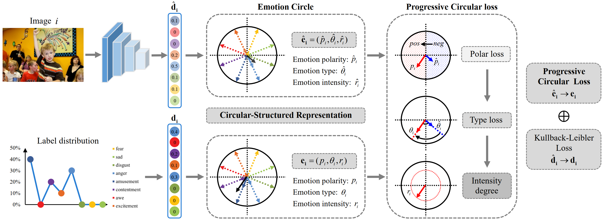

# A Circular-structured Representation for Visual Emotion Distribution Learning (CVPR2021)

Jingyuan Yang, Jie Li, Leida Li, Xiumei Wang, Xinbo Gao;
### [Paper](https://openaccess.thecvf.com/content/CVPR2021/html/Yang_A_Circular-Structured_Representation_for_Visual_Emotion_Distribution_Learning_CVPR_2021_paper.html)

Visual Emotion Analysis (VEA) has attracted increasing attention recently with the prevalence of sharing images on social networks. Since human emotions are ambiguous and subjective, it is more reasonable to address VEA in a label distribution learning (LDL) paradigm rather than a single-label classification task. Different from other LDL tasks, there exist intrinsic relationships between emotions and unique characteristics within them, as demonstrated in psychological theories. Inspired by this, we propose a well-grounded circular-structured representation to utilize the prior knowledge for visual emotion distribution learning. To be specific, we first construct an Emotion Circle to unify any emotional state within it. On the proposed Emotion Circle, each emotion distribution is represented with an emotion vector, which is defined with three attributes (i.e., emotion polarity, emotion type, emotion intensity) as well as two properties (i.e., similarity, additivity). Besides, we design a novel Progressive Circular (PC) loss to penalize the dissimilarities between predicted emotion vector and labeled one in a coarse-to-fine manner, which further boosts the learning process in an emotion-specific way. Extensive experiments and comparisons are conducted on public visual emotion distribution datasets, and the results demonstrate that the proposed method outperforms the state-of-the-art methods.

